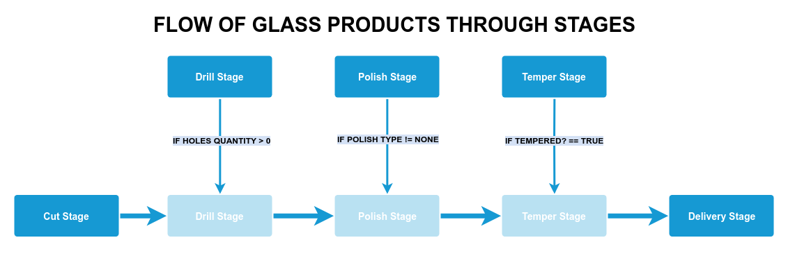

# Readme

This readme is in progress and is updated day by day.

Glass is a glass products manufactory app. It supports the tracking through five production stages: Cut, Drill, Polish, Temper and Delivery.

# Functionality

* Create new order
* Order activation
* PDF reports and ZPL labels
* Perform cuts simulating a CNC automatic machine
* Update order progress through stages

### Create New Orders
An order has one or many glass products. For products you must set  
* holes quantity [0..99]  
* polish type [ None | Flat Polish | Pencil Edge ] 
* tempered process [ Yes | No ]

### Order activation
When an order is created, an asyn job process is launched using Sidekiq and Redis.  

That action creates the tracking objects in database, depending on the attributes for each product (holes, polish type and temper process).

All products must be processed at Cut and Delivery stages.

The process performs some fake process too, like external API calls and email delivery. Randomly they can fail to simulate real world conditions where things fails.  
If a fake service raise an exception, the whole Order activation process will be rolledback because it is wrapped in a transaction. So, if an activation fails, you can retry the activation in the In Progress view.

#### Action Cable
The result of an order activation will be notified by an ActionCable event, showing up a message on user screen.
When a work is completed on a stage -clicking Complete Work button or performing Cut Machine programs- a *New!* alert will appear on the Activities sidebar button, and a new activity row will be added in real-time on the Activities view. 

### PDF reports and ZPL labels
Prawn gem generates PDF reports and Labelary API show labels designed with ZPL format.

### Update order progress through stages

aca van imagenes

For any glass, a stage is available only if there are completed works on the previous stage.

Cut                                            Drill                                      Polish
Available 0 Completed 10        Available 3 Completed 7    Available 7  Completed 0

# Front End
The app use Gentelella Free Theme

# Use of Patterns

### ServiceObject
In progress

### Composite
Report Module is created following the Composite pattern. That way, if you want to add a new report titled “Users Ranking”, you will need to create only the Report::Type::UsersRanking class and you can reuse the existing code without changing another line of code. Likewise if you want to add a new full detail header design for yours reports, you must create only a new Report::Header::FullDetail class and then instantiate the Report::Document class with param[:header] = ‘full_detail’.

# API

# ToDo
* Dockerize app
* Add pagination (kaminari or DataTable JQuery plugin)
* Add more tests
* Add more API functionality
* Add instructions to config and setup the app on development enviroment
